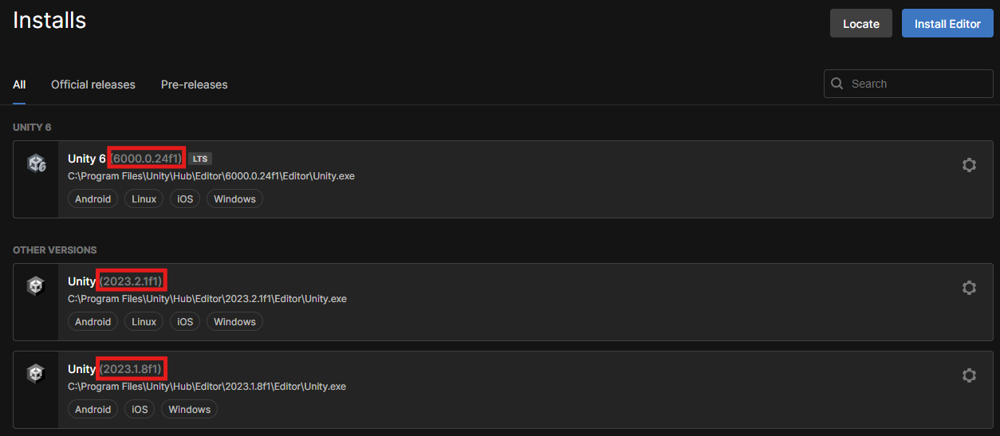
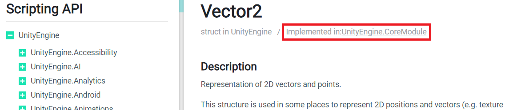

# Unity3D NuGet Package


[](https://nuget.org/packages/Unity3D)
[](https://nuget.org/packages/Unity3D)
[](./CHANGELOG.md)
[](./LICENSE)
[](./CODE_OF_CONDUCT.md)
[](https://github.com/Rabadash8820/UnityAssemblies/issues)

This repository contains the source code for the [`Unity3D` NuGet package](https://www.nuget.org/packages/Unity3D).

`Unity3D` allows developers to effectively reference assemblies of the Unity game engine (e.g., `UnityEngine.dll`) as NuGet packages.

If you find this package useful, consider supporting its development!

<a href="https://www.buymeacoffee.com/shundra882n" target="_blank"></a>

_Unity® and the Unity logo are trademarks of Unity Technologies._

## Contents

- [Basic Usage](#basic-usage)
- [Why Another NuGet Package for Unity?](#why-another-nuget-package-for-unity)
- [Usage](#usage)
  - [Editing the project files](#editing-the-project-files)
  - [Choosing a `TargetFramework`](#choosing-a-targetframework)
  - [Referencing additional Unity assemblies](#referencing-additional-unity-assemblies)
  - [Referencing assemblies stored in a Unity project](#referencing-assemblies-stored-in-a-unity-project)
  - [Referencing assemblies at non-default install locations](#referencing-assemblies-at-non-default-install-locations)
  - [Removing the default reference to UnityEngine.dll](#removing-the-default-reference-to-unityenginedll)
  - [Referencing the Unity core modules](#referencing-the-unity-core-modules)
  - [Referencing assemblies in specific Unity versions](#referencing-assemblies-in-specific-unity-versions)
- [Available Short-Hand Properties](#available-short-hand-properties)
  - [Versions 2.x](#versions-2x-properties)
  - [Versions 1.x](#versions-1x-properties)
- [FAQ](#faq)
- [Support](#support)
- [Contributing](#contributing)
- [License](#license)

## Basic Usage

[Install this package](https://docs.microsoft.com/en-us/nuget/consume-packages/overview-and-workflow#ways-to-install-a-nuget-package)
then follow the steps below for the version you installed. Replace `UnityVersion` with your installed Unity Editor version.

### Version 2.x

Add a `Directory.Build.props` file in the same folder as your .csproj file (or any of its parent folders), with content like the following:

```xml
<Project>
    <PropertyGroup>
        <UnityProjectPath>path\to\UnityProject</UnityProjectPath>
        <!-- Or -->
        <UnityVersion>2022.1.1f1</UnityVersion>
    </PropertyGroup>
</Project>
```

### Version 1.x

Add a `UnityVersion` property to your .csproj, so it looks like the following:

```xml
<Project Sdk="Microsoft.NET.Sdk">
    <PropertyGroup>
        <TargetFramework>netstandard2.1</TargetFramework>
        <UnityVersion>2022.1.1f1</UnityVersion>
    </PropertyGroup>
    <ItemGroup>
        <PackageReference Include="Unity3D" Version="2.0.1" />
    </ItemGroup>
    <!-- Other properties/items -->
</Project>
```

## Why Another NuGet Package for Unity?

It's true, there are a number of good NuGet packages for Unity [already available on nuget.org](https://www.nuget.org/packages?q=unity3d).
Unfortunately, most of these packages are no longer being updated and have a number of issues. Almost all of them fall into one of two categories:

1. **Containing the actual Unity binaries within the package.** These packages include:
    - [Unity3D.SDK](https://www.nuget.org/packages/Unity3D.SDK/) by amelkor
    - [UnityEngine](https://www.nuget.org/packages/UnityEngine/) by Leanwork
    - [Unity3D.UnityEngine](https://www.nuget.org/packages/Unity3D.UnityEngine/)
    - [Unity3D.UnityEngine.UI](https://www.nuget.org/packages/Unity3D.UnityEngine.UI) by Dzmitry Lahoda
    - [UnityEngine5](https://www.nuget.org/packages/UnityEngine5/) by Taiyoung Jang.

    The problem with these packages (aside from the questionable legality of re-distributing Unity Technologies' binaries),
    is that a new version of the package must be pushed for each new version of Unity.
    When these packages stop being updated (which has happened in almost every case),
    then they are no longer useful because they don't allow you to program against the latest Unity APIs.
    Most of them do not have versions for Unity 2019.1+, and/or do not support the modern .NET Standard profiles.
2. **Containing some kind of script that adds references to assemblies from a particular installed version of Unity.**
    The main package in this category is [Unity3D.DLLs](https://www.nuget.org/packages/Unity3D.DLLs/) by Precision Mojo, LLC.
    This package uses a PowerShell script to add references to the latest version of Unity installed on a user's machine.
    which is powerful, as it theoretically makes the package forward-compatible with all versions of Unity yet to come.
    Unfortunately, this package has not been updated since 2013, meaning that many of the NuGet/PowerShell conventions that it relied upon are no longer supported in the newest versions of Visual Studio.
    Even when the package was current, it located the Unity assemblies in a clever but brittle manner that does not support the newer Unity Hub install locations,
    assumed that there was only one Unity installation per machine, and, more importantly, only worked on Windows (using the Windows registry).

Moreover, only Dzmitry Lahoda's packages seem to recognize the need for _other_ Unity assemblies besides just `UnityEngine`.
As more advanced Unity users will know, `UnityEngine.dll` doesn't contain everything.
Editor scripts also require a reference to `UnityEditor.dll`,
UI types like `Text` and `Button` require a reference to `UnityEngine.UI.dll`,
assemblies from Asset Store assets are stored in the project folder under `Assets/`,
and many types were split from the Unity assemblies as Unity broke up editor features into Packages.

Therefore, this NuGet package was designed with the following goals:

- Add Unity assembly references programmatically, so that the package is forward-compatible
- Add references via standard MSBuild tooling, rather than clunky scripts in unfamiliar or unsupported programming languages
- Allow devs to reference additional Unity assemblies with simple `Reference` items in the project file, rather than by calling some obscure script
- Provide short-hand MSBuild properties for the most common Unity assemblies, with paths that resolve on all dev platforms (Windows/MacOS/Linux)
- Require minimal configuration: just a Unity version or Unity project path, and an optional install path for non-default setups

## Usage

**Don't freak out!** The [basic usage](#basic-usage) example above will satisfy the large majority of use cases. The usage options below are for more advanced setups.

As shown in the basic example above, this package only requires a `UnityVersion` or (in v2) `UnityProjectPath` property to be up and running.
`UnityVersion` must be a complete version string, in the format used by Unity Hub (the values boxed in red in the screenshot below).



In versions 1.x, this property should be added to your .csproj file. See the next section for instructions.

In versions 2.x, it _must_ be added to a `Directory.Build.props` file.
If you're working with a specific Unity project, the recommendation is to set `UnityProjectPath` rather than `UnityVersion`.
This NuGet package will then look up the project's Unity version from its `ProjectSettings/ProjectVersion.txt` file,
so that when you update the project to a new Unity version, your assembly references will also update.
`UnityProjectPath` must be the path to a Unity project folder, not the `Assets/` subfolder.
Try to define the path relative to `Directory.Build.props` so that it resolves across platforms
(this works well when your MSBuild/Visual Studio project and Unity project are in the same repository).
If both `UnityVersion` and `UnityProjectPath` are provided, then the explicit version will take precedence.
If you do not set `UnityVersion` _or_ `UnityProjectPath`, then `UnityVersion` will default to the constant string "SET_VERSION_OR_PROJECT".
If you see this text in the paths of assembly references in your IDE, then you'll know that those properties are missing or inaccessible to this NuGet package.
Make sure that one of these properties is defined in `Directory.Build.props` for versions 2.x, and _not_ in your .csproj file.

### Editing the project files

To edit a project file in Visual Studio:

- **When targeting .NET Standard (recommended):** just double-click on the project in the Solution Explorer
- **When targeting .NET 4.x:** right click on the project in the Solution Explorer, click `Unload project`, then right click again to select `Edit <YourProject>.csproj`. When you're done editing the file, right click on the project again and select `Reload project`. Having to unload the project before editing can be cumbersome, so check out this excellent [article by Scott Hanselman](https://www.hanselman.com/blog/UpgradingAnExistingNETProjectFilesToTheLeanNewCSPROJFormatFromNETCore.aspx) for instructions on migrating to the newer, leaner SDK syntax of .NET Standard.

To add a `Directory.Build.props` file for version 2.x, simply create a text file and rename it.
`.props` files are special files that .NET projects (specifically, MSBuild projects) can use to set additional build properties.
`Directory.Build.props`, in particular, is a [standard `.props` file](https://docs.microsoft.com/en-us/visualstudio/msbuild/customize-your-build?view=vs-2022#directorybuildprops-and-directorybuildtargets) that MSBuild will import _before_ importing other NuGet packages.
You must set the `UnityVersion` or `UnityProjectPath` property in `Directroy.Build.props`, so that it is available to this NuGet package
for defining a [bunch of its own properties](#available-short-hand-properties) for the various Unity assembly paths.

You can create the `Directory.Build.props` file in the same folder as your .csproj, or any of its parent folders.
[MSBuild walks](https://docs.microsoft.com/en-us/visualstudio/msbuild/customize-your-build?view=vs-2022#search-scope) the directory structure upwards from your project location,
stopping once it locates a `Directory.Build.props` file.

**Warning:** You cannot use any of this NuGet package's [available short-hand properties](available-short-hand-properties) in the `Directory.Build.props` file,
as they are not in scope at that point. See the [MSBuild import order](https://docs.microsoft.com/en-us/visualstudio/msbuild/customize-your-build#import-order) for more info.

### Choosing a `TargetFramework`

For new projects, you should use the modern "SDK-style" .csproj files, which have a root `<Project Sdk="...">` element rather than `<Project ToolsVersion="...">`.
This style yields smaller, more readable project files, and simplifies portability with projects built against other .NET runtimes.
You should then use one of the following .NET Standard `TargetFramework`s:

- For Unity 2021.2+, use `netstandard2.1`
- For Unity 2021.1 and below, use `netstandard2.0`

If, however, you are working with an existing, older project, then you may be forced to use one of the following .NET 4.x `TargetFramework`s:

- For Unity 2021.2+, use `net48` :
- For Unity 2020.2 - 2021.1, use `net472`
- For Unity 2020.1 and below, use `net461`

If you don't, you will see errors like:

> The primary reference ... could not be resolved because it has an indirect dependency on the assembly ...
which was built against the ".NETFramework,Version=v4.[x]" framework.
This is a higher version than the currently targeted framework ".NETFramework,Version=v4.[y]".

### Referencing additional Unity assemblies

By default, this package only adds a reference to `UnityEngine.dll`. However, there are several other Unity assemblies that your project might need to reference.
These include `UnityEditor.dll` for writing custom editors, or `UnityEngine.UI.dll` for referencing UI types like `Text` and `Button`.
To reference these assemblies, add `Reference` items to your `.csproj`, like so:

```xml
<ItemGroup>
    <Reference Include="$(UnityEditorPath)" Private="false" />  <!-- Versions 2.x -->
    <Reference Include="$(UnityInstallRoot)\$(UnityVersion)\$(UnityEditorPath)" Private="false" />  <!-- Versions 1.x -->
</ItemGroup>
```

Note the use of the `*Path` MSBuild properties.
These properties spare you from remembering the default Unity install path or the relative paths to any Unity assemblies,
and they also make the references work across platforms (Windows/MacOS/Linux).
See below for the full list of [provided short-hand properties](#available-short-hand-properties).

Also note the use of [`Private="false"`](https://docs.microsoft.com/en-us/visualstudio/msbuild/common-msbuild-project-items#reference).
This basically means "don't copy the referenced assembly to the output folder".
This is recommended, so that Unity assemblies aren't being copied around unnecessarily, since they're automatically linked with managed plugins inside the Unity Editor.

If you want to reference a Unity assembly for which there is no short-hand property, you can just hard-code its path into a `Reference` item yourself.
If it is one of Unity's built-in assemblies, then the path should start with `$(UnityInstallRoot)\$(UnityVersion)\`,
so that it resolves across platforms, and so you're not duplicating the Unity version in multiple paths.
If it is an assembly under your `UnityProjectPath` then see the next section.

### Referencing assemblies stored in a Unity project

You may need to reference assemblies stored in a Unity project folder (i.e., under `Assets/` or `Library/`).
This is especially common when your code and Unity project are stored in the same repository,
and you want to reference assemblies from Asset Store assets or Packages that you've installed.
In these cases, the paths in your `Reference` items should be relative paths, so that they resolve across platforms.
When you define an MSBuild property named `$(UnityProjectPath)` to store this relative path, you can use it as a short-hand for multiple `Reference`s.
Moreover, there are a [couple short-hand properties](#available-short-hand-properties) for common assembly paths under `UnityProjectPath`.
For example, if you want to raise Standard Events with the [Analytics package](https://docs.unity3d.com/Manual/com.unity.analytics.html)
and use the [Addressables](https://docs.unity3d.com/Manual/com.unity.addressables.html) workflow, then your `.csproj` would look something like:

In versions 2.x (`UnityProjectPath` defined in `Directory.Build.props`):

```xml
<Project Sdk="Microsoft.NET.Sdk">
    <ItemGroup>
        <Reference Include="$(UnityAnalyticsStandardEventsPath)" Private="false" />
        <Reference Include="$(UnityScriptAssembliesPath)\Unity.Addressables.dll" Private="false" />
    </ItemGroup>
</Project>
```

In versions 1.x:

```xml
<Project Sdk="Microsoft.NET.Sdk">
    <PropertyGroup>
        <!-- Other properties... -->
        <UnityProjectPath>/relative/path/to/unity/project</UnityProjectPath>
    </PropertyGroup>
    <ItemGroup>
        <Reference Include="$(UnityProjectPath)\$(UnityAnalyticsStandardEventsPath)" Private="false" />
        <Reference Include="$(UnityProjectPath)\$(UnityScriptAssembliesPath)\Unity.Addressables.dll" Private="false" />
    </ItemGroup>
</Project>
```

**Note: the Unity project must have been built recently, so that the `Library/` folder actually contains the imported assemblies!**

Also note that, while there are short-hand properties for a couple assemblies under the `PackageCache` folder (see the [full list](#available-short-hand-properties)),
there are _no_ short-hand properties for assemblies stored in the `ScriptAssemblies` folder.
That folder is completely flat, so you can just reference assemblies there by filename.

### Referencing assemblies at non-default install locations

Because Unity Hub is the installation tool [recommended by Unity Technologies](https://docs.unity3d.com/Manual/GettingStartedInstallingUnity.html),
this package checks for Unity assemblies at Unity Hub's default install locations by default.
If you are not using Unity Hub, or are using non-default install locations, then you can override the path where this package searches for Unity assemblies
by setting the `UnityInstallRootPath` and/or `OSInstallRootPath` MSBuild properties (`UnityInstallRoot` or `OSInstallRoot` for versions 1.x).
See the [list of short-hand properties](#available-short-hand-properties) to understand these properties' default values and how they are interpreted.

For example, if you were using a Windows machine and you installed a Unity version without Unity Hub on your `V:` drive,
or set the "Installs location" to your `V:` drive in Unity Hub preferences, then you would need the following code:

Versions 2.x:

```xml
<!-- In `Directory.Build.props` -->
<PropertyGroup>
    <UnityInstallRootPath>V:\</UnityInstallRootPath>
    <!-- Other properties... -->
</PropertyGroup>
```

Versions 1.x:

```xml
<!-- In your `.csproj` file -->
<PropertyGroup>
    <UnityInstallRoot>V:\</UnityInstallRoot>
    <!-- Other properties... -->
</PropertyGroup>
```

On collaborative projects, hard-coding paths is insufficient, as contributors may be using a mixture of default and non-default install locations.
To support user-specific Unity install locations, you can use MSBuild [property functions](https://learn.microsoft.com/en-us/visualstudio/msbuild/property-functions) in your version-controlled `UnityInstallRoot[Path]` and/or `OSInstallRoot[Path]` properties.
For example, you could read the path from a `UNITY_OS_INSTALL_ROOT` environment variable. Each collaborator would need to define that variable on their machine.
Then, your versioned MSBuild property would be:

Versions 2.x:

```xml
<UnityInstallRootPath>$([System.Environment]::GetEnvironmentVariable('UNITY_OS_INSTALL_ROOT'))</UnityInstallRootPath>
```

Versions 1.x:

```xml
<UnityInstallRoot>$([System.Environment]::GetEnvironmentVariable('UNITY_OS_INSTALL_ROOT'))</UnityInstallRoot>
```

**Warning: If your property function returns `null` or an empty string (e.g., if a collaborator did _not_ set the required environment variable),
then this package still uses the default `UnityInstallRoot[Path]` and/or `OSInstallRoot[Path]`.**

### Removing the default reference to UnityEngine.dll

You may not want to keep the default reference to `UnityEngine.dll`, e.g., if you only need a reference to some other Unity assembly,
or want to reference Unity's module assemblies directly.
To remove the `Reference` from your project, simply use the MSBuild Item remove syntax, i.e., add the following line to an `<ItemGroup>` in your `.csproj`:

**Warning: If using directory imports, be sure to put the below line in `Directory.Build.targets`, not `Directory.Build.props`,
otherwise you'll be trying to remove the Reference before it's been added!**

```xml
<Reference Remove="$(UnityEnginePath)" />   <!-- Versions 2.x -->
<Reference Remove="$(UnityInstallRoot)\$(UnityVersion)\$(UnityEnginePath)" />   <!-- Versions 1.x -->
```

### Referencing the Unity core modules

`UnityEngine.dll` is actually built up from multiple smaller "module" assemblies stored in the `UnityModulesPath`.
These modules contain types related to Audio, Animation, Particle Systems, Navigation, etc.
If you are writing a managed plugin that references assemblies from a Package, you may get confusing compiler errors from APIs in the Package that use types defined in a module.
For example, if you reference the Unity UI Package from Unity 2019.2+, and use it to access `ScrollRect.velocity` (which returns a `Vector2`),
you would see an error like:

> Error CS0012 The type 'Vector2' is defined in an assembly that is not referenced. You must add a reference to assembly 'UnityEngine.CoreModule, Version=0.0.0.0, Culture=neutral, PublicKeyToken=null'.

This error is shown because Unity UI's assembly doesn't use the `Vector2` type from `UnityEngine.dll`; it uses the type from the _module assembly_ `UnityEngine.CoreModule`.
Therefore, the default reference to `UnityEngine.dll` added by this NuGet package does not satisfy the compiler.
However, if you reference both `UnityEngine.dll` _and_ the module assembly, then you'll get compiler errors about duplicate type definitions.

The solution is to [remove the default reference](#removing-the-default-reference-to-unityenginedll) to `UnityEngine.dll`,
and then reference each module that you need individually.
So, for this particular example, your `.csproj` might look like the following.

In versions 2.x:

```xml
<ItemGroup>
    <!-- Other Package assembly references -->
    <Reference Include="$(UnityScriptAssembliesPath)\UnityEngine.UI.dll" Private="false" />

    <Reference Remove="$(UnityEnginePath)" />
    <Reference Include="$(UnityModulesPath)\UnityEngine.CoreModule.dll" Private="false" />
    <!-- Other module references -->
</ItemGroup>
```

In versions 1.x:

```xml
<ItemGroup>
    <!-- Other Package assembly references -->
    <Reference Include="$(UnityProjectPath)\$(UnityScriptAssembliesPath)\UnityEngine.UI.dll" Private="false" />

    <Reference Remove="$(UnityInstallRoot)\$(UnityVersion)\$(UnityEnginePath)" />
    <Reference Include="$(UnityInstallRoot)\$(UnityVersion)\$(UnityModulesPath)\UnityEngine.CoreModule.dll" Private="false" />
    <!-- Other module references -->
</ItemGroup>
```

There are _no_ short-hand properties for assemblies stored in `$(UnityModulesPath)`. The folder is completely flat, so you can just reference assemblies there by filename.
If you're unsure of which modules to reference, check out the Unity Scripting Manual.
Every type includes an `Implemented in` note at the top of the page, telling you in which of Unity's core modules the type is implemented.
For example, see the screenshot below of the manual page for `Vector2`:

**Warning: There is a Unity module assembly named `UnityEngine.dll`.
This is not to be confused with the `UnityEngine.dll` assembly under `$(UnityManagedPath)`!
After [removing the default `UnityEngine.dll`](#removing-the-default-reference-to-unityenginedll) reference from your project,
you may still need to reference this module for types like `GUIElement`, `Network`, `ProceduralMaterial`, etc.**



### Referencing assemblies in specific Unity versions

**Note: this section does not apply to versions 1.x.**

Unity assembly paths sometimes change between versions: new assemblies are added, old ones are removed or broken up into UPM packages.
If your managed plugin must support multiple versions of Unity, then you may want to say
"reference this assembly, but only in these Unity versions" or "reference this assembly using the correct version-specific path".
For scenarios like these, there are new MSBuild properties in v2 that expose the major, minor, and patch versions of your project's `UnityVersion`:

1. `UnityVersionMajor`: e.g., `2021` in `2021.3.5f1`
2. `UnityVersionMinor`: e.g., `3` in `2021.3.5f1`
3. `UnityVersionPatch`: e.g., `5f1` in `2021.3.5f1`
4. `UnityVersionAsNumber`: equals `$(UnityVersionMajor).$(UnityVersionMinor)`, e.g., `2021.3` in `2021.3.5f1`

These properties cannot be overriden, since they are parsed directly from the `UnityVersion` that you provide
(or from the `ProjectVersion.txt` file under the `UnityProjectPath` that you provide).

The major, minor, and `UnityVersionAsNumber` properties are numeric, so you can use them in range inequalities in your project files.
For example, suppose you wanted to reference NUnit in an editor plugin that supports multiple versions of Unity.
The Unity Test Framework has included NUnit since version 2019.2, but for older versions of Unity, you would have to import NUnit yourself.
Therefore, to reference NUnit in _any_ Unity version, you could use [MSBuild Conditions](https://docs.microsoft.com/en-us/visualstudio/msbuild/msbuild-conditions) like the following in your project file:

**Warning: "less than" (`<`) inequalities must be escaped with `&lt;`, since MSBuild project files are still XML files.**

```xml
<ItemGroup>
    <!-- Other References -->
    <Reference Include="custom\path\to\nunit.framework.dll" Private="False" />
    <Reference Condition="'$(UnityVersionAsNumber)'>='2019.2'" Include="$(NunitPath)" Private="False" />
</ItemGroup>
```

The second `Reference` will overwrite the first for projects referencing Unity 2019.2+ assemblies.

For assembly paths that change between Unity versions (e.g., `UnityEngineUIPath`),
the short-hand properties adjust according to the provided (or parsed) `UnityVersion`, using code much like above,
so you don't need to worry about conditionally setting the paths yourself.
If a path is not applicable in a particular Unity version (such as `NunitPath` in Unity 2019.1 and below),
then its MSBuild property will be undefined for that version (e.g., `$(NunitPath)` would be empty).

## Available Short-Hand Properties

Note that, unless otherwise noted, _any_ of the following properties can be overwritten by setting the property manually.
For versions 2.x, set them in `Directory.Build.props`; for versions 1.x, you can set them directly in your .csproj file.
For example, to change the UI assembly's path, you could set:

```xml
<UnityEngineUIPath>path\to\UnityEngine.UI.dll</UnityEngineUIPath>
```

As assembly paths change in future versions of Unity, you can continue referencing them by overwriting these properties, until the properties are updated in this package.
This ability makes this NuGet package truly "forward-compatible".
You can manually override the property for a single assembly (e.g., `UnityEnginePath`),
or for many assemblies under the same absolute/relative base path (e.g., `UnityModulesPath` or `UnityModulesDir`).

Generally, properties named `*Path` are absolute paths, and properties named `*Dir` or `*Assembly` are relative paths.
Most assembly path properties (e.g., `UnityPackageCachePath`) are a combination of a relative path property (e.g., `UnityPackageCacheDir`)
and a base path, which might use another short-hand property.
Through clever use of these properties, you can even reference assemblies from more than one Unity project.
You might do this if you wanted to reference an assembly at the same relative path in two different Unity projects under different conditions.
You could use the same _relative_ short-hand property in both cases, but set the base path conditionally.

The assembly paths under the `Library/PackageCache` folder use the `*` wildcard.
This spares you from hard-coding a UPM package version and updating it every time you update the package in Unity's Package Manager window.
Unity only stores one version of a Package in the `PackageCache` folder, so you don't need to worry about multiple versions of the same Package being referenced by the wildcard.
When adding references to other UPM package assemblies, you should precede the `*` wildcard with `%40`
(an [MSBuild-escaped](https://learn.microsoft.com/en-us/visualstudio/msbuild/how-to-escape-special-characters-in-msbuild#to-use-an-msbuild-special-character-as-a-literal-character) `@` character)
to prevent conflicts with "sub-namespace" assembly names.
For example, you could reference both `org.nuget.microsoft.extensions.logging%40*\Microsoft.Extensions.Logging.dll` and
`org.nuget.microsoft.extensions.logging.abstractions%40*\Microsoft.Extensions.Logging.Abstractions.dll`, without the former's wildcard overwriting the latter.

**Note: It is worth repeating that, unless otherwise noted, _any_ of these properties can be manually overridden.**

### Versions 2.x properties

| Property | Default value | Comments |
|:---------|:--------------|:---------|
| `OSInstallRootPath` | `C:\Program Files` on Windows, `/Application` on MacOS, or `/home/<username>` on Linux. |  |
| `UnityVersionMajor` | 0 | Major version parsed from `UnityVersion` (e.g., `2021` from `2021.3.5f1`). Cannot be overriden. |
| `UnityVersionMinor` | 0 | Minor version parsed from `UnityVersion` (e.g., `3` from `2021.3.5f1`). Cannot be overriden. |
| `UnityVersionPatch` | 0 | Patch version parsed from `UnityVersion` (e.g., `5f1` from `2021.3.5f1`). Cannot be overriden. |
| `UnityVersionAsNumber` | 0.0 | Equals `$(UnityVersionMajor).$(UnityVersionMinor)`. Cannot be overriden. Useful for making numeric comparisons against the Unity version in MSBuild Conditions. |
| `UnityInstallRootDir` | `Unity\Hub\Editor` | Referenced by `UnityInstallRootPath`. |
| `UnityInstallRootPath` | `$(OSInstallRootPath)\$(UnityInstallRootDir)` |  |
| `UnityVersionInstallPath` | `$(UnityInstallRootPath)\$(UnityVersion)` |  |
| `UnityManagedDir` | `Editor\Data\Managed` on Linux/Windows or `Unity.app\Contents\Managed` on MacOS. | Referenced by `UnityManagedPath`. |
| `UnityManagedPath` | `$(UnityVersionInstallPath)\$(UnityManagedDir)` |  |
| `UnityExtensionsDir` | `Editor\Data\UnityExtensions\Unity` on Linux/Windows or `Unity.app\Contents\UnityExtensions\Unity` on MacOS. | Referenced by `UnityExtensionsPath`. |
| `UnityExtensionsPath` | `$(UnityVersionInstallPath)\$(UnityExtensionsDir)` |  |
| `UnityModulesDir` | `UnityEngine` | Referenced by `UnityModulesPath`. |
| `UnityModulesPath` | `$(UnityManagedPath)\$(UnityModulesDir)` | This folder contains assemblies for Unity's core modules like the Audio, Animation, and ParticleSystem modules. |
| `UnityPlaybackEnginesDir` | `Editor\Data\PlaybackEngines` | Referenced by `UnityPlaybackEnginesPath`. |
| `UnityPlaybackEnginesPath` | `$(UnityVersionInstallPath)\$(UnityPlaybackEnginesDir)` | This folder contains target-platform-specific assemblies, e.g. those for iOS/Android. |
| `UnityAndroidPlayerDir` | `$(UnityPlaybackEnginesDir)\AndroidPlayer` | Referenced by `UnityAndroidPlayerPath`. |
| `UnityAndroidPlayerPath` | `$(UnityVersionInstallPath)\$(UnityAndroidPlayerDir)` |  |
| `UnityiOSSupportDir` | `$(UnityPlaybackEnginesDir)\iOSSupport` | Referenced by `UnityiOSSupportPath`. |
| `UnityiOSSupportPath` | `$(UnityVersionInstallPath)\$(UnityiOSSupportDir)` |  |
| `UnityScriptAssembliesDir` | `Library\ScriptAssemblies` | Referenced by `UnityScriptAssembliesPath`. |
| `UnityScriptAssembliesPath` | `$(UnityProjectPath)\$(UnityScriptAssembliesDir)` |  |
| `UnityBuiltInPackagesDir` | `Editor\Data\Resources\PackageManager\BuiltInPackages` | Referenced by `UnityBuiltInPackagesPath`. Only defined if `UnityVersion` is >= 2017.2. |
| `UnityBuiltInPackagesPath` | `$(UnityVersionInstallPath)\$(UnityBuiltInPackagesDir)` | This folder contains assemblies from Unity's built-in Packages, like IMGUI and TerrainPhysics (for all other UPM Package assemblies, see `UnityPackageCachePath`). Only defined if `UnityVersion` is >= 2017.2. |
| `UnityProjectPath` | N/A | This property has no default value. Set it to the absolute path of the root folder of your Unity project, so that you can easily reference Package and Asset Store assemblies (as [described above](#referencing-assemblies-stored-in-a-unity-project)). |
| `UnityPackageCacheDir` | `Library\PackageCache` | Referenced by `UnityPackageCachePath`. Only defined if `UnityVersion` is >= 2017.2. |
| `UnityPackageCachePath` | `$(UnityProjectPath)\$(UnityPackageCacheDir)` | This folder contains assemblies from UPM packages (for built-in Packages, see `UnityBuiltInPackagesPath`). Only defined if `UnityVersion` is >= 2017.2. |
| `UnityEnginePath` | `$(UnityManagedPath)\UnityEngine.dll` | This reference is added by default. See [instructions to remove it](#removing-the-default-reference-to-unityenginedll). |
| `UnityEditorPath` | `$(UnityManagedPath)\UnityEditor.dll` |  |
| `UnityEngineUIPath` | `$(UnityScriptAssembliesPath)\UnityEngine.UI.dll` for Unity 2019.3+, `$(UnityExtensionsPath)\GUISystem\UnityEngine.UI.dll` for Unity 2019.2 and below |
| `UnityEngineTestRunnerPath` | `$(UnityScriptAssembliesPath)\UnityEngine.TestRunner.dll` for Unity 2019.3+, `$(UnityExtensionsPath)\TestRunner\UnityEngine.TestRunner.dll` for Unity 2019.2 and below |
| `UnityEditorAndroidExtensionsPath` | `$(UnityAndroidPlayerPath)\UnityEditor.Android.Extensions.dll` | See types under `UnityEditor > UnityEditor.Android` in the [Unity Scripting API docs](https://docs.unity3d.com/ScriptReference/index.html) |
| `UnityEditoriOSExtensionsCommonPath` | `$(UnityiOSSupportPath)\UnityEditor.iOS.Extensions.Common.dll` | See types under `UnityEditor > UnityEditor.iOS` in the [Unity Scripting API docs](https://docs.unity3d.com/ScriptReference/index.html) |
| `UnityEditoriOSExtensionsXcodePath` | `$(UnityiOSSupportPath)\UnityEditor.iOS.Extensions.Xcode.dll` | See types under `UnityEditor > UnityEditor.iOS` in the [Unity Scripting API docs](https://docs.unity3d.com/ScriptReference/index.html) |
| `NewtonsoftJsonAssembly` | `com.unity.nuget.newtonsoft-json%40*\Runtime\Newtonsoft.Json.dll` | Requires installation of the [Performance Testing Extension](https://docs.unity3d.com/Packages/com.unity.test-framework.performance@1.0/manual/index.html) for Unity Test Runner package. Referenced by `NewtonsoftJsonPath`. Only defined if `UnityVersion` is between 2019.3 and 2022.1, inclusive. |
| `NewtonsoftJsonPath` | `$(UnityPackageCachePath)\$(NewtonsoftJsonAssembly)` for Unity 2019.3-2022.1, `$(UnityManagedPath)\Newtonsoft.Json.dll` for Unity 2022.2+ | In Unity 2019.3-2022.1, requires installation of the [Performance Testing Extension](https://docs.unity3d.com/Packages/com.unity.test-framework.performance@1.0/manual/index.html) for Unity Test Runner package. No extra installations required in Unity 2022.2+. |
| `NunitAssembly` | `com.unity.ext.nunit%40*\net35\unity-custom\nunit.framework.dll` | Requires installation of the [Test Framework](https://docs.unity3d.com/Packages/com.unity.test-framework@1.1/manual/index.html) package. Referenced by `NunitPath`. Only defined if `UnityVersion` is >= 2019.2. |
| `NunitPath` | `$(UnityPackageCachePath)\$(NunitAssembly)` | Requires installation of the [Test Framework](https://docs.unity3d.com/Packages/com.unity.test-framework@1.1/manual/index.html) package. Only defined if `UnityVersion` is >= 2019.2. |
| `MoqAssembly` | `nuget.moq%40*\Moq.dll` | Requires installation of the [Test Framework](https://docs.unity3d.com/Packages/com.unity.test-framework@1.1/manual/index.html) package. In Unity 2020.1+, [download Moq from NuGet](https://www.nuget.org/packages/moq/) and import it as a managed plugin. Referenced by `MoqPath`. Only defined if `UnityVersion` is between 2019.2 and 2019.3, inclusive. |
| `MoqPath` | `$(UnityPackageCachePath)\$(MoqAssembly)` | Requires installation of the [Test Framework](https://docs.unity3d.com/Packages/com.unity.test-framework@1.1/manual/index.html) package. In Unity 2020.1+, [download Moq from NuGet](https://www.nuget.org/packages/moq/) and import it as a managed plugin. Only defined if `UnityVersion` is between 2019.2 and 2019.3, inclusive. |
| `UnityAnalyticsStandardEventsAssembly` | `com.unity.analytics%40*\AnalyticsStandardEvents\Unity.Analytics.StandardEvents.dll` | Requires installation of the [Analytics Library](https://docs.unity3d.com/Packages/com.unity.analytics@3.3/manual/index.html) package. Referenced by `UnityAnalyticsStandardEventsPath`. Only defined if `UnityVersion` is >= 2019.2. |
| `UnityAnalyticsStandardEventsPath` | `$(UnityPackageCachePath)\$(UnityAnalyticsStandardEventsAssembly)` | Requires installation of the [Analytics Library](https://docs.unity3d.com/Packages/com.unity.analytics@3.3/manual/index.html) package. Only defined if `UnityVersion` is >= 2019.2. |

### Versions 1.x properties

| Property | Unity Version | Default value | Comments |
|:---------|---------------|:--------------|:---------|
| `OSInstallRoot` | Any | `C:\Program Files` on Windows, `/Application` on MacOS, or `/home/<username>` on Linux. |  |
| `UnityInstallRoot` | Any | `$(OSInstallRoot)\Unity\Hub\Editor` |  |
| `UnityManagedPath` | Any | `Editor\Data\Managed` on Linux/Windows or `Unity.app\Contents\Managed` on MacOS. |  |
| `UnityModulesPath` | Any | `$(UnityManagedPath)\UnityEngine` | This folder contains assemblies for Unity's core modules like the Audio, Animation, and ParticleSystem modules. |
| `UnityExtensionsPath` | Any | `Editor\Data\UnityExtensions\Unity` on Linux/Windows or `Unity.app\Contents\UnityExtensions\Unity` on MacOS. |  |
| `UnityPlaybackEnginesPath` | Any | `Editor\Data\PlaybackEngines` | This folder contains target-platform-specific assemblies, e.g. those for iOS/Android. |
| `UnityAndroidPlayerPath` | Any | `$(UnityPlaybackEnginesPath)\AndroidPlayer` |  |
| `UnityiOSSupportPath` | Any | `$(UnityPlaybackEnginesPath)\iOSSupport` |  |
| `UnityBuiltInPackagesPath` | >= 2017.2 | `Editor\Data\Resources\PackageManager\BuiltInPackages` | This folder contains assemblies from Unity's built-in Packages, like IMGUI and TerrainPhysics (for all other UPM Package assemblies, see `UnityPackageCachePath`). |
| `UnityEnginePath` | Any | `$(UnityManagedPath)\UnityEngine.dll` | This reference is added by default. See above for [instructions to remove it](#removing-the-default-reference-to-unityenginedll). |
| `UnityEditorPath` | Any | `$(UnityManagedPath)\UnityEditor.dll` |  |
| `UnityEngineUIPath` | <= 2019.2 | `$(UnityExtensionsPath)\GUISystem\UnityEngine.UI.dll`. | In Unity 2019.3+, use `$(UnityProjectPath)\$(UnityScriptAssembliesPath)\UnityEngine.UI.dll` instead. |
| `UnityEngineTestRunnerPath` | <= 2019.2 | `$(UnityExtensionsPath)\TestRunner\UnityEngine.TestRunner.dll` | In Unity 2019.3+, use `$(UnityProjectPath)\$(UnityScriptAssembliesPath)\UnityEngine.TestRunner.dll` instead. |
| `UnityProjectPath` | Any | N/A | This property has no default value. Point it at the root folder of your Unity project, so that you can more easily reference Package and Asset Store assemblies (as [described above](#referencing-assemblies-stored-in-a-unity-project)). |
| `UnityPackageCachePath` | >= 2017.2 | `Library\PackageCache` | This folder contains assemblies from UPM packages (for built-in Packages, see `UnityBuiltInPackagesPath`). |
| `UnityScriptAssembliesPath` | Any | `Library\ScriptAssemblies` |  |
| `NewtonsoftJsonPath` | >= 2019.3 | `$(UnityPackageCachePath)\com.unity.nuget.newtonsoft-json*\Runtime\Newtonsoft.Json.dll` | Requires installation of the [Performance Testing Extension](https://docs.unity3d.com/Packages/com.unity.test-framework.performance@1.0/manual/index.html) for Unity Test Runner package. |
| `NunitPath` | >= 2019.2 | `$(UnityPackageCachePath)\com.unity.ext.nunit*\net35\unity-custom\nunit.framework.dll` | Requires installation of the [Test Framework](https://docs.unity3d.com/Packages/com.unity.test-framework@1.1/manual/index.html) package. |
| `MoqPath` | 2019.2, 2019.3 | `$(UnityPackageCachePath)\nuget.moq*\Moq.dll` | Requires installation of the [Test Framework](https://docs.unity3d.com/Packages/com.unity.test-framework@1.1/manual/index.html) package. In Unity 2020.1+, [download Moq from NuGet](https://www.nuget.org/packages/moq/) and import it as a managed plugin. |
| `UnityAnalyticsStandardEventsPath` | >= 2019.2 | `$(UnityPackageCachePath)\com.unity.analytics*\AnalyticsStandardEvents\Unity.Analytics.StandardEvents.dll` | Requires installation of the [Analytics Library](https://docs.unity3d.com/Packages/com.unity.analytics@3.3/manual/index.html) package. |
| `UnityEditorAndroidExtensionsPath` | Any | `$(UnityAndroidPlayerPath)\UnityEditor.Android.Extensions.dll` | See types under `UnityEditor > UnityEditor.Android` in the [Unity Scripting API docs](https://docs.unity3d.com/ScriptReference/index.html) |
| `UnityEditoriOSExtensionsCommonPath` | Any | `$(UnityiOSSupportPath)\UnityEditor.iOS.Extensions.Common.dll` | See types under `UnityEditor > UnityEditor.iOS` in the [Unity Scripting API docs](https://docs.unity3d.com/ScriptReference/index.html) |
| `UnityEditoriOSExtensionsXcodePath` | Any | `$(UnityiOSSupportPath)\UnityEditor.iOS.Extensions.Xcode.dll` | See types under `UnityEditor > UnityEditor.iOS` in the [Unity Scripting API docs](https://docs.unity3d.com/ScriptReference/index.html) |

## FAQ

1. **Why would I use this NuGet package?**
    The primary, intended use case for this NuGet is for Unity developers writing [managed plugins](https://docs.unity3d.com/Manual/UsingDLL.html)
    (pre-compiled DLLs that will be imported into Unity) that also depend on Unity APIs.
    It allows developers to reference the Unity assemblies via `Reference` items in their project files, just like they might reference any other NuGet package or local assembly,
    without having to remember Unity's assembly paths or keep them up-to-date and cross-platform.
    With the option to [use Unity as a library](https://blogs.unity3d.com/2019/06/17/add-features-powered-by-unity-to-native-mobile-apps/) in 2019.3+,
    developers might also use this package in native mobile apps created with [Xamarin](https://dotnet.microsoft.com/apps/xamarin),
    or in really any library or executable that needs access to the Unity APIs.
1. **How does this work?**
    This NuGet package [imports an MSBuild .props file](https://docs.microsoft.com/en-us/nuget/create-packages/creating-a-package#including-msbuild-props-and-targets-in-a-package) into your project,
    which adds the various properties and `Reference` items at build time.
    In versions 2.x and above, these properties can use the `UnityVersion` property that you define in `Directory.Build.props` because that file is imported before NuGet packages.
    And when you set `UnityProjectPath`, the Unity version can instead be parsed from the project's `ProjectVersion.txt` file using `File.ReadAllText`
    in an [MSBuild static property function](https://docs.microsoft.com/en-us/visualstudio/msbuild/property-functions?static-property-functions).
1. **Are the `Reference` paths really cross-platform?**
    Yes, but only paths that begin with the default `$(OSInstallRootPath)` and `$(UnityInstallRootPath)` properties (`$(OSInstallRoot)` or `$(UnityInstallRoot)` in versions 1.x), or with a custom relative or cross-platform base path that you define.
    This works through a magical little combination of [MSBuild Conditions](https://docs.microsoft.com/en-us/visualstudio/msbuild/msbuild-conditions)
    and the [`IsOsPlatform()` Property Function](https://docs.microsoft.com/en-us/visualstudio/msbuild/property-functions#msbuild-property-functions).
1. **Is this package officially maintained by Unity Technologies?**
    No, it is maintained by [one wild and crazy guy](https://github.com/Rabadash8820).
    However, this package will be submitted to Unity Technologies as it gains traction,
    **_so that maybe we can finally have an officially supported NuGet package for Unity assemblies!_**
1. **If not, how is this package legal?**
    Well, it's not actually distributing the Unity assembly binaries, just MSBuild files that reference them.
    This NuGet package won't do anything (except add some build warnings) if you haven't actually installed a version of Unity on your machine.
1. **Can you help me solve [error] in Unity [version]?**
    Possibly. Compatibility is only tested with, and support offered for, the latest Unity [LTS releases](https://unity3d.com/unity/qa/lts-releases) and the TECH stream releases of the current year.
    Unity does not officially support versions older than that, so neither does this package!
    That said, if you're having an issue with an older version of Unity, there's a good chance that someone in this community has seen it before,
    so feel free to [open an Issue](https://github.com/Rabadash8820/UnityAssemblies/issues)!
1. **With which Unity versions has this package been officially tested?**
    In the following:
    - 2022.1
    - 2021.3 LTS, 2021.2, 2021.1
    - 2020.3 LTS, 2020.1
    - 2019.4 LTS
    - 2018.4 LTS
1. **Why hasn't this repository been updated since [date]?**
    This NuGet package is very simple, with most of its functionality contained in a [single file](./nupkg/build/Unity3D.props).
    Between that, and the package's use of forward-compatible properties like `UnityVersion` that can be tweaked at design time,
    this repository simply does not require frequent updates.
    Most changes going forward will be to add more short-hand properties, and to add test projects for new versions of Unity.

## Support

Issues and support questions may be posted on this repository's [Issues page](https://github.com/Rabadash8820/UnityAssemblies/issues).
Please check if your Issue has already been answered/addressed by a previous Issue before creating a new one. 🙏

## Contributing

Please refer to the [Contributing guide](./CONTRIBUTING.md).

## License

[MIT](./LICENSE)
