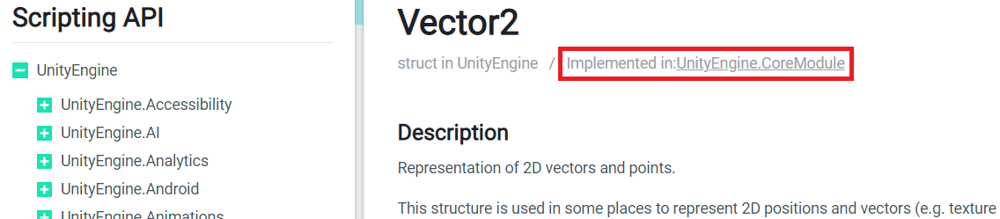

# Unity3D v3 - Usage

- -> Usage
  - [Basic Usage](#basic-usage)
  - [Editing the project files](#editing-the-project-files)
  - [Choosing a `TargetFramework`](#choosing-a-targetframework)
  - [Referencing additional Unity assemblies](#referencing-additional-unity-assemblies)
  - [Referencing assemblies stored in a Unity project](#referencing-assemblies-stored-in-a-unity-project)
  - [Referencing assemblies at non-default install locations](#referencing-assemblies-at-non-default-install-locations)
  - [Removing the default references](#removing-the-default-references)
  - [Referencing the Unity core modules](#referencing-the-unity-core-modules)
  - [Referencing assemblies in specific Unity versions](#referencing-assemblies-in-specific-unity-versions)
  - [CI/CD Pipelines](#cicd-pipelines)
- [Available Short-Hand Properties](./short-hand-properties.md)
- [FAQ](./faq.md)

## Basic Usage

[Install this package](https://docs.microsoft.com/en-us/nuget/consume-packages/overview-and-workflow#ways-to-install-a-nuget-package)
then add lines like the following to your .csproj file (or any imported MSBuild project file).

```xml
<Project Sdk="Microsoft.NET.Sdk">
    <PropertyGroup>
        <UnityProjectPath>$(MSBuildProjectDirectory)\relative\path\to\UnityProject</UnityProjectPath>
        <!-- Or -->
        <UnityVersion>6000.0.49f1</UnityVersion>
    </PropertyGroup>
</Project>
```

This satisfies the large majority of use cases. For more advanced setups, read on.

As shown in that basic example, this package only requires a `UnityVersion` or `UnityProjectPath` property to be up and running.
`UnityVersion` must be a complete version string, in the format used by Unity Hub (the values boxed in red in the screenshot below).


If you're working with a specific Unity project, then the recommendation is to set `UnityProjectPath` instead of `UnityVersion`.
This NuGet package will then look up the project's Unity version from its `ProjectSettings/ProjectVersion.txt` file,
so that when you update the project to a new Unity version, your assembly references will also update.
`UnityProjectPath` must be the path to a Unity project folder, _not the `Assets/` subfolder_.
Try to define the path relative to the MSBuild project's directory (i.e., relative to `$(MSBuildProjectDirectory)`) so that it resolves across platforms.
This works especially well when your MSBuild (Visual Studio) project and Unity project are in the same repository.
If both `UnityVersion` and `UnityProjectPath` are provided, then the explicit version will take precedence.
If you do not set `UnityVersion` _or_ `UnityProjectPath`, then `UnityVersion` will default to the constant string `"SET_VERSION_OR_PROJECT"`.
If you see this string in the paths of assembly references in your IDE, then the properties are missing or inaccessible to this NuGet package.

## Editing the project files

To edit a project file in Visual Studio:

- **When targeting .NET Standard (recommended):** just double-click on the project in the Solution Explorer
- **When targeting .NET 4.x:** right click on the project in the Solution Explorer, click `Unload project`, then right click again to select `Edit <YourProject>.csproj`.
    When you're done editing the file, right click on the project again and select `Reload project`. Having to unload the project before editing can be cumbersome,
    so check out this excellent [article by Scott Hanselman](https://www.hanselman.com/blog/UpgradingAnExistingNETProjectFilesToTheLeanNewCSPROJFormatFromNETCore.aspx)
    for instructions on migrating to the newer, leaner SDK syntax of .NET Standard.

## Choosing a `TargetFramework`

For new projects, you should use the modern "SDK-style" .csproj files, which have a root `<Project Sdk="...">` element rather than `<Project ToolsVersion="...">`.
This style yields smaller, more readable project files, and simplifies portability with projects built against other .NET runtimes.
You should then use one of the following .NET Standard `TargetFramework`s:

- For Unity 2021.2+, use `netstandard2.1`
- For Unity 2021.1 and below, use `netstandard2.0`

If, however, you are working with an existing, older project, then you may be forced to use one of the following .NET 4.x `TargetFramework`s:

- For Unity 2021.2+, use `net48` :
- For Unity 2020.2 - 2021.1, use `net472`
- For Unity 2020.1 and below, use `net461`

If you don't, you will see errors like:

> The primary reference ... could not be resolved because it has an indirect dependency on the assembly ...
which was built against the ".NETFramework,Version=v4.[x]" framework.
This is a higher version than the currently targeted framework ".NETFramework,Version=v4.[y]".

## Referencing additional Unity assemblies

By default, this package only adds a reference to the core Unity modules (essentially, the types in `UnityEngine.dll`).
However, there are several other Unity assemblies that your project might need to reference.
These include `UnityEditor.dll` for writing custom editors, or `UnityEngine.UI.dll` for referencing UI types like `Text` and `Button`.
To reference these assemblies, add `Reference` items to your `.csproj`, like so:

```xml
<ItemGroup>
    <Reference Include="$(UnityEditorPath)" Private="false" />
</ItemGroup>
```

Note the use of a `*Path` MSBuild property.
These properties spare you from remembering the default Unity install paths or the relative paths to any Unity assemblies,
and they also let the references work across platforms (Windows/MacOS/Linux).
See below for the full list of [provided short-hand properties](./short-hand-properties.md).

Also note the use of [`Private="false"`](https://docs.microsoft.com/en-us/visualstudio/msbuild/common-msbuild-project-items#reference).
This basically means "don't copy the referenced assembly to the output folder".
This is recommended so that Unity assemblies aren't being copied around unnecessarily, since they're automatically linked with managed plugins inside the Unity Editor.

If you want to reference a Unity assembly for which there is no short-hand property, you can just hard-code its path into a `<Reference>` item yourself.
If it is one of Unity's built-in assemblies, then the path should start with `$(UnityInstallRoot)\$(UnityVersion)\`,
so that it resolves across platforms, and so you're not duplicating the Unity version in multiple paths.
If it is an assembly under your `UnityProjectPath` then see the next section.

## Referencing assemblies stored in a Unity project

You may need to reference assemblies stored in a Unity project folder (i.e., under `Assets/` or `Library/`).
This is especially common when your code and Unity project are stored in the same repository,
and you want to reference assemblies from Asset Store assets or Packages that you've installed.
In these cases, the paths in your `Reference` items should be relative paths, so that they resolve across platforms.
When you define an MSBuild property named `$(UnityProjectPath)` to store this relative path, you can use it as a short-hand for multiple `Reference`s.
Moreover, there are a [couple short-hand properties](./short-hand-properties.md) that refer to common assembly paths under `UnityProjectPath`.
For example, if you wanted to consume uGUI types like `Button` or `Text`
_and_ use the [Addressables](https://3d.com/Manual/com.unity.addressables.html) workflow,
then your `.csproj` would look something like this:

```xml
<Project Sdk="Microsoft.NET.Sdk">
    <PropertyGroup>
        <UnityProjectPath>$(MSBuildProjectDirectory)\relative\path\to\UnityProject</UnityProjectPath>
    </PropertyGroup>
    <ItemGroup>
        <Reference Include="$(UnityEngineUIPath)" Private="false" />
        <Reference Include="$(UnityScriptAssembliesPath)\Unity.Addressables.dll" Private="false" />
    </ItemGroup>
</Project>
```

> [!IMPORTANT]
> The Unity project must have been opened once, so that the `Library/` folder actually contains the imported assemblies!

> [!TIP]
> While there are short-hand properties for a couple assemblies under the `PackageCache` folder (see the [full list](./short-hand-properties.md)),
> there are _no_ short-hand properties for assemblies stored in the `ScriptAssemblies` folder.
> That folder is completely flat, so you can just reference assemblies there by filename.

## Referencing assemblies at non-default install locations

Because Unity Hub is the installation tool [recommended by Unity Technologies](https://3d.com/Manual/GettingStartedInstallingUnity.html),
this package checks for Unity assemblies at Unity Hub's default install locations by default.
If you are not using Unity Hub, or are using non-default install locations, then you can override the path where this package searches for Unity assemblies
by setting the `UnityInstallRootPath` and/or `OSInstallRootPath` MSBuild properties.
See the [list of short-hand properties](./short-hand-properties.md) to understand these properties' default values and how they are interpreted.

For example, if you were using a Windows machine and you installed a Unity version without Unity Hub on your `V:` drive,
or set the "Installs location" to your `V:` drive in Unity Hub preferences, then you would need the following MSBuild code:

```xml
<PropertyGroup>
    <UnityInstallRootPath>V:\</UnityInstallRootPath>
    <!-- Other properties... -->
</PropertyGroup>
```

On collaborative projects, hard-coding paths is insufficient, as contributors may be using a mixture of default and non-default install locations.
To support user-specific Unity install locations, you can use MSBuild [property functions](https://learn.microsoft.com/en-us/visualstudio/msbuild/property-functions)
in your version-controlled `UnityInstallRoot[Path]` and/or `OSInstallRoot[Path]` properties.
For example, you could read the path from a `UNITY_OS_INSTALL_ROOT` environment variable. Each collaborator would need to define that variable on their machine.
Then, your versioned MSBuild property would be:

```xml
<UnityInstallRootPath>$([System.Environment]::GetEnvironmentVariable('UNITY_OS_INSTALL_ROOT'))</UnityInstallRootPath>
```

> [!NOTE]
> If your property function returns `null` or an empty string (e.g., if a collaborator did _not_ set the required environment variable),
> then this package still uses the default `UnityInstallRoot[Path]` and/or `OSInstallRoot[Path]`.

## Removing the default references

You may not want to keep the default Unity assembly references added by this NuGet package.
E.g., you may only need a reference to some other Unity assembly or want to reference individual Unity module assemblies explicitly.
To remove the references from your project, simply add the following line to a `<PropertyGroup>` in your MSBuild project file(s):

```xml
<IncludeDefaultUnityAssemblyReferences>False</IncludeDefaultUnityAssemblyReferences>
```

## Referencing the Unity core modules

`UnityEngine.dll` is actually built up from multiple smaller "module" assemblies stored in the `UnityModulesPath`.
These modules contain types related to Audio, Animation, Particle Systems, Navigation, etc.
If you are writing a managed plugin that references assemblies from a UPM package as well as `UnityEngine.dll`,
then you may get confusing compiler errors from APIs in the package that use types defined in a module.
For example, if you reference the Unity UI Package from Unity 2019.2+, and use it to access `ScrollRect.velocity` (which returns a `Vector2`),
you would see an error like:

> Error CS0012 The type 'Vector2' is defined in an assembly that is not referenced. You must add a reference to assembly 'UnityEngine.CoreModule, Version=0.0.0.0, Culture=neutral, PublicKeyToken=null'.

This error is shown because Unity UI's assembly doesn't reference the `Vector2` type from `UnityEngine.dll`; it uses the type from the _module assembly_ `UnityEngine.CoreModule`.
Therefore, the reference to `UnityEngine.dll` does not satisfy the compiler.
However, if you reference both `UnityEngine.dll` _and_ the module assembly, then you'll get compiler errors about duplicate type definitions!

The solution is to remove the reference to `UnityEngine.dll` (using MSBuild's Item `Remove` syntax) and instead reference each module that you need individually.
Note that, for versions 2.2.0+ of this NuGet, Unity's module assemblies are referenced by default (rather than the "monolithic" `UnityEngine.dll`),
so you will likely never run into the aforementioned compiler errors.

For the preceding example, your `.csproj` might look like the following.

```xml
<ItemGroup>
    <!-- Other Package assembly references -->
    <Reference Include="$(UnityScriptAssembliesPath)\UnityEngine.UI.dll" Private="false" />

    <Reference Remove="$(UnityEnginePath)" />
    <Reference Include="$(UnityModulesPath)\UnityEngine.CoreModule.dll" Private="false" />
    <!-- Other module references -->
</ItemGroup>
```

> [!TIP]
> There are _no_ short-hand properties for assemblies stored in `$(UnityModulesPath)`;
> the folder is completely flat, so you can just reference assemblies there by filename.

If you're unsure of which modules to reference, check out the Unity Scripting Manual.
Every type includes an "Implemented in" note at the top of the page, telling you in which of Unity's core modules the type is implemented.
For example, see the screenshot below of the manual page for `Vector2`:



> [!NOTE]
> There is a Unity module assembly named `UnityEngine.dll`.
> This is not to be confused with the monolithic `UnityEngine.dll` assembly at `$(UnityEnginePath)`!
> It contains types like `GUIElement`, `Network`, and `ProceduralMaterial`.

## Referencing assemblies in specific Unity versions

Unity assembly paths sometimes change between versions: new assemblies are added, old ones are removed or broken up into UPM packages.
If your managed plugin must support multiple versions of Unity, then you may want to say
"reference this assembly, but only in these Unity versions" or "reference this assembly using the correct version-specific path".
For scenarios like these, this package provides MSBuild properties that expose the major, minor, and patch versions of your project's `UnityVersion`:

1. `UnityVersionMajor`: e.g., `2021` in `2021.3.5f1`
2. `UnityVersionMinor`: e.g., `3` in `2021.3.5f1`
3. `UnityVersionPatch`: e.g., `5f1` in `2021.3.5f1`
4. `UnityVersionAsNumber`: equals `$(UnityVersionMajor).$(UnityVersionMinor)`, e.g., `2021.3` in `2021.3.5f1`

These properties cannot be overriden, since they are parsed directly from the `UnityVersion` that you provide
(or from the `ProjectVersion.txt` file under the `UnityProjectPath` that you provide).

The major, minor, and `UnityVersionAsNumber` properties are numeric, so you can use them in range inequalities in your project files.
For example, suppose you wanted to reference NUnit in an editor plugin that supports multiple versions of Unity.
The Unity Test Framework has included NUnit since version 2019.2, but for older versions of Unity, you would have to import NUnit yourself.
Therefore, to reference NUnit in _any_ Unity version, you could use [MSBuild Conditions](https://docs.microsoft.com/en-us/visualstudio/msbuild/msbuild-conditions) like the following in your project file:

> [!IMPORTANT]
> "Less than" (`<`) inequalities must be escaped with `&lt;`, since MSBuild project files are still XML files.

```xml
<ItemGroup>
    <!-- Other References -->
    <Reference Include="custom\path\to\nunit.framework.dll" Private="False" />
    <Reference Condition="'$(UnityVersionAsNumber)'>='2019.2'" Include="$(NunitPath)" Private="False" />
</ItemGroup>
```

The second `Reference` will overwrite the first for projects referencing Unity 2019.2+ assemblies.

For assembly paths that change between Unity versions (e.g., `UnityEngineUIPath`),
the short-hand properties adjust according to the provided (or parsed) `UnityVersion`, using code much like above,
so you don't need to worry about conditionally setting the paths yourself.
If a path is not applicable in a particular Unity version (such as `NunitPath` in Unity 2019.1 and below),
then its MSBuild property will be undefined for that version (e.g., `$(NunitPath)` would be empty).

## CI/CD Pipelines

This package works with many different CI/CD (Continuous Integration/Continuous Deployment) setups.
Just remember that this package does not actually include any Unity assemblies; it only _references_ them at expected locations.
Therefore, whatever system is running .NET builds in your pipeline (be that a server, VM, container, etc.)
must separately install the desired version of the Unity engine or its assemblies.

Here are some possible solutions:

- **Use [Unity Build Automation](https://unity.com/solutions/ci-cd) (formerly Unity Cloud Build).**
    This is Unity's first-party build automation web service,
    so it will always have the latest Unity versions, build features, and solid integration with other [Unity Gaming Services](https://unity.com/solutions/gaming-services).
    Simply select your project's Unity version (or tell UBA to look up the version from a `ProjectVersion.txt`)
    and then the build machine will have the associated Unity assemblies pre-installed.
    You can run whatever additional build scripts you want and use this NuGet package.
    You can still host your code from anywhere; UBA builds are triggered by a webhook.
- **Compile your C# code _outside_ of Unity (e.g., in Visual Studio).**
    You can copy the generated DLLs/PDBs via an MSBuild post-build event so that
    they're imported into Unity as [managed plugins](https://docs.unity3d.com/Manual/UsingDLL.html) and won't require compilation during the CI/CD build process.
    It's recommended to version those generated files in the same repository as the C# code (e.g., with [Git LFS](https://git-lfs.com/)).
    It might feel redundant to store code and built executables in the same repository, but this serves the same benefits as storing, e.g.,
    artists' PhotoShop project files and generated images in the same repository;
    namely, experts can work on the "source" files, but other team members (and the CI/CD pipeline) can
    just work with "built" files without random build errors/warnings from the source.
    This approach also lets you use (most of) the latest C# language features since you're not tied to Unity's compiler version.
- **Run the [unityci/editor](https://hub.docker.com/r/unityci/editor) images from Docker Hub.**
    This option is good if your CI/CD system supports containerized build agents.
    New tags are regularly added for the latest Unity versions as part of the [GameCI](https://game.ci/) project.
    This Unity3D NuGet package will work inside a container run from those images.
- **Use [Unity Build Server](https://unity.com/products/unity-build-server).**
    This option is good if you already have on-premise build servers; this service helps scale/manage on-prem builds.
- **Copy the actual Unity assemblies to your build agent.**
    It is strongly recommended to store the assemblies on shared network storage or in a private NuGet package feed
    (e.g., [GitHub Packages](https://github.com/features/packages) or [Azure Artifacts](https://azure.microsoft.com/en-us/products/devops/artifacts)).
    Doing so allows you to easily reference the assemblies and share them between projects to reduce the size of your repositories and build agents.
